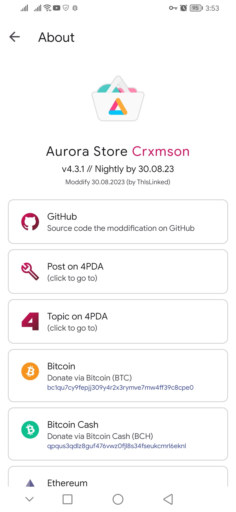

A moddify/fork the original [Aurora Store source project](https://gitlab.com/AuroraOSS/AuroraStore). Developable for non-commercial purposes for end-personal use.

* [Moddification post on the 4PDA forum](https://4pda.to/forum/index.php?showtopic=887569&view=findpost&p=116441910)
* [Topic Aurora Store on the 4PDA forum](https://4pda.to/forum/index.php?showtopic=887569)

*This project is intended for the CIS territory. There is no localizations for other regions. Except for English USA - it acts as default localization.*

**Current status project:** Waiting for updates 

###### @ 2023 [ThIsLinked](https://t.me/thislinked) / [dhwh](https://4pda.to/forum/index.php?showuser=9870529)

# Main changes from original

> **Note:**
```
This changelog may have fewer items than what actually appears in the latest builds.
This happens because I may forget to update it or otherwise edit it.
Always check for changes in the real binary build.
```
```
Android Studio mangles the code of some resources at compiling time.
Use the source code only for research or custom variants. The apk's,
published by me, do not have such a defect, since I corrected them from
such a misunderstanding. Use them in case of pure use – they look
exactly as they were supposed to in the specification.
```

* Some interface edits and improvements + changed default color to Crimson, v31 and above – system dynamic color.;
* The list colors for accent is taken from the [Material Design palette](https://m2.material.io/design/color/the-color-system.html#color-theme-creation);
* On the application page, some elements are now available for highlighting with the cursor (so that the text can be copied to the clipboard);
* Redesigned and/or rearranged sections and items in settings;
* Restoring full functionality of [Deep Links](https://developer.android.com/training/app-links/deep-linking) (fix [#7082](https://4pda.to/forum/index.php?showtopic=887569&view=findpost&p=124420039));
* Added Play Store version selection in settings ([merge !193](https://gitlab.com/AuroraOSS/AuroraStore/-/merge_requests/193)). ***It still requires account reauthorization***;
* Added mono-profiles: xxhdpi, API 27, all languages and architectures - ARMv7, ARM64-v8, x86 and x64. *The original source of the original configuration – [#2896](https://4pda.to/forum/index.php?showtopic=887569&view=findpost&p=106493433);*
* Redesigned icons in about + transferred array from Smali to ARSC;
* Redesigned launcher icon: VectorDrawable rendering only, API 26 and above – adaptive, API 33 and above – monochrome (optiomal);
* Redesigned banner for Android TV;
* Changed the background interval check for apps updates - from 30 hours to 24 hours;
* Removed automatic update of Aurora itself;

> ### Only in apk's published by me:
> * Removal of obfuscation and/or minification;
> * Removed stock profiles;
> * Removal of Logcat calls;
> * Cleanup Smali from garbage, include debug lines;
> * Cleanup resources from garbage;
> * Removed mdpi, ldpi and ldrtl;
> * Optimization of apk at archive level;
> * Sign dhwh v1+v2+v3 (on 4PDA);
> * SignThIsLinked v1+v2+v3 (on the general web);
> <details><summary>Signature dhwh hash</summary>
>
> _**HEX/DEC:** 0x97d83e3e (-1747435970)_
>
> _**CRC32/DEC:** 0x6a8059f7 (1786796535)_
>
> _**MD5:** 050284900ab95f8de385b8552951cbcc_
>
> _**SHA1:** 6e6b12dbb39099654d1043826e7f9480eee29b55_
>
> _**SHA256:** b21ac037532ea9ae47e98afacb9756fb116f0b11c51860c8115d29512a69eb6c_
> </details>
> <details><summary>Signature ThIsLinked hash</summary>
>
> _**HEX/DEC:** 0x6264f009 (1650782217)_
>
> _**CRC32/DEC:** 0xe2e95680 (-488024448)_
>
> _**MD5:** 21247d96e07877efc1867081d6697a56_
>
> _**SHA1:** 052e470e98d916ad731fca81c38a80b5309eea0e_
>
> _**SHA256:** 2d2e593e349bfff9b371228604579d30028719fe13e97d5ca0610d92ea6c948_
> </details>

# Screenshots

*Please note that these are early screenshots and may not reflect current releases.*

<details><summary>[click spoiler]</summary>

</details>

# Gratitudes

* vladrevers ([GitLab](https://gitlab.com/vladrevers), [4PDA](https://4pda.to/forum/index.php?showuser=5081201)) – Help in Smali and educational directions;
* Maximoff ([official site](https://maximoff.su/), [GitLab](https://gitlab.com/maximoff), [4PDA](https://4pda.to/forum/index.php?showuser=4424665)) – Source code for implementing functions;
* tigr1234566 ([Telegram](https://t.me/tommyhellatigr), [4PDA](https://4pda.to/forum/index.php?showuser=6432902)) – Tester;
* master1274 ([GitLab](https://gitlab.com/anikin.rusl), [4PDA](https://4pda.to/forum/index.php?showuser=5042804)) – Tester;

# License

```
This project has inherited the original license (GPL v3.0) provided by the original developer.
Developed for non-commercial purposes primarily for final personal use. Allowed further editing
from yourself face. Use for plagiarism purposes is prohibited. Content created by the community
that contributed to this project, as well as content freely available on global web used here,
de jure inherits the original license, de facto unlicensed still protected by copyrighted.

If you use someone else's material in your work, do not forget who exactly created this material...
```
